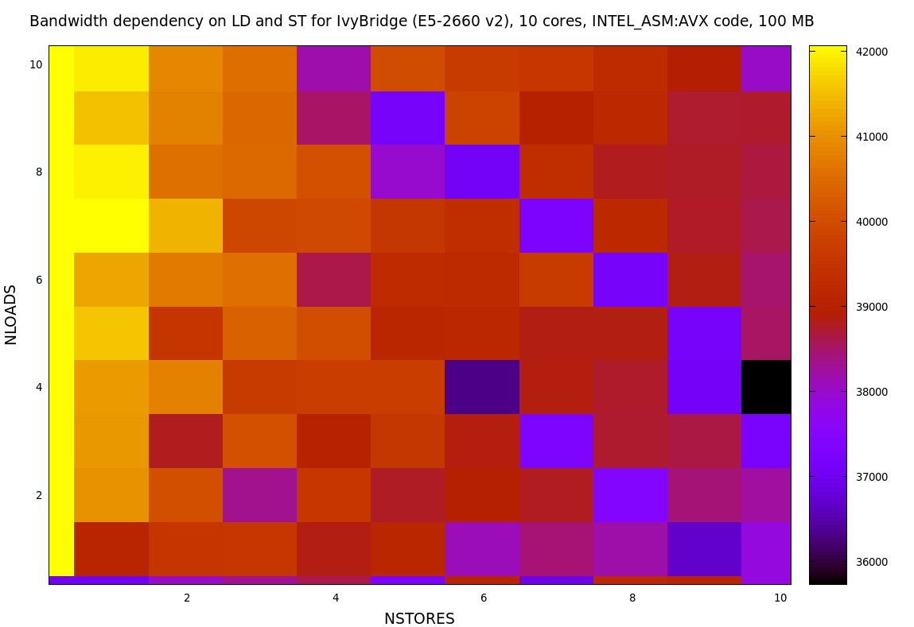

# LDST-bench

Performance modelling and estimation constantly requires the bandwidth. 
However the bandwidth of the processors can vary depending on:
* Load, store ratio
* Number of streams

LDST-bench allows to quantify all the combinations of loads and store streams

Usage : ./LDST-bench [METHOD] [COMPILER] [NTHREAD] [NUM_LOAD] [NUM_STORE] [SIZE_PER_THREAD(MB)] -v[OPTIONAL]
  * METHOD : what type of code, available options C, INTEL_ASM:SCALAR, INTEL_ASM:SSE, INTEL_ASM:AVX, INTEL_ASM:AVX512, ARM_ASM:NEON
  * COMPILER : specify the C++ compiler to use, supported and tested compilers icpc,g++,clang
  * NTHREAD : number of threads for benchmarking, currently only close (fill) pin is supported
  * NUM_LOAD : number of load streams
  * NUM_STORE : number of store streams
  * SIZE_PER_THREAD : Combined size of all streams per thread in MB
  * -v : Specify for verbose output

Examples for C method, g++ compiler, 10 threads, and 100 MB per thread
 * Copy : ./LDST-bench C g++ 10 1 1 100
 * Load : ./LDST-bench C g++ 10 1 0 100
 * Copy with 19 streams (like LBM codes) : ./LDST-bench C g++ 10 19 19 100 -v
 

